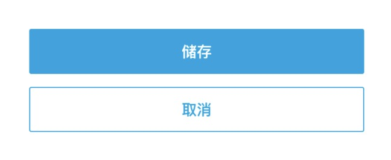

# Button

`請勿限制Button大小(父層包 Container height), 會截斷文字` 


## 表單完成時使用該按鈕樣式


```dart
Padding(
      padding: EdgeInsets.symmetric(horizontal: 20),
        child: Column(
          children: [
            Button.primary(
              rounded: ButtonRounded.circle,
              isOutline: true,
              isBlock: true,
              textStyle: TextStyle(fontWeight: FontWeight.bold),
              text: Intl.message('Explore the newest free\n games while waiting!', name: 'modal_joinPromotionModal_latestFreeGame').toUpperCase(),
              onPressed: () => OneContext().pushReplacementNamed('/freeGame'),
            ),
            Button(
              isBlock: true,
              textStyle: TextStyle(fontSize: 14, color: kPrimaryColor, decoration: TextDecoration.underline),
              text: Intl.message('Or contact our customer service for assistance.', name: 'modal_joinPromotionModal_customerService').toUpperCase(),
              onPressed: customerUrl != null ? () => launch(customerUrl) : () {},
            ),
          ],
        )
    ),
```

## 表單填寫送出或取消時使用按鈕樣式


```dart
Padding(
              padding: EdgeInsets.symmetric(horizontal: 20),
              child: Column(
                children: [
                  Padding(
                    padding: EdgeInsets.only(bottom: 10),
                    child: Button.primary(
                      text: Intl.message('Deposit now', name: 'page_coupon_couponModal_goToDeposit').toUpperCase(),
                      isBlock: true,
                      onPressed: () => OneContext().pushNamed('/deposit/menu'),
                    ),
                  ),
                  Padding(
                    padding: EdgeInsets.only(bottom: 10),
                    child: Button.primary(
                      text: Intl.message('Have a problem? Contact our customer service now.', name: 'page_coupon_couponModal_cannotParticipate').toUpperCase(),
                      isOutline: true,
                      isBlock: true,
                      onPressed: customerUrl != null ? () => launch(customerUrl) : () {},
                    ),
                  ),

                ],
              ),
            ),
```